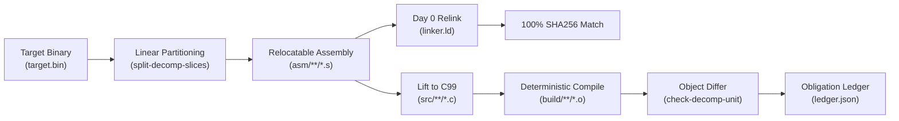

# Matching Decompilation Guide

Matching decompilation is the process of reverse engineering a compiled binary or firmware image into human-readable, idiomatic source code (such as C99) that, when compiled with a matching toolchain, produces **byte-for-byte, bit-exact identical machine code**.

REA provides an end-to-end matching decompilation workflow for native Linux ELF binaries, Windows PE binaries, and bare-metal ARM Cortex-M/MIPS firmware. It guarantees a **Day 0 Full-Binary Relink Invariant** (100% bit-exact relinking from the first step) and systematically transitions assembly slices into documented, idiomatic C translation units tracked through an authenticated obligation ledger.

---

## Table of Contents

1. [Core Concepts & Day 0 Invariant](#core-concepts--day-0-invariant)
2. [End-to-End Workflow](#end-to-end-workflow)
3. [Configuration Schema (`decomp.yaml`)](#configuration-schema-decompyaml)
4. [CLI Commands Reference](#cli-commands-reference)
5. [MCP Tools Reference](#mcp-tools-reference)
6. [Semantic Decompilation Enrichment Suite (SDES)](#semantic-decompilation-enrichment-suite-sdes)
7. [Automated AST Permutation & Flag Sweeps](#automated-ast-permutation--flag-sweeps)
8. [Reconstruction Obligation Tracking](#reconstruction-obligation-tracking)
9. [Edge Cases & Compiler Tuning](#edge-cases--compiler-tuning)
10. [Example Projects & Evaluation Reports](#example-projects--evaluation-reports)

---

## Core Concepts & Day 0 Invariant

Traditional decompilers output pseudocode that cannot be compiled, or emits a single monolithic file that deviates from the original binary layout.

REA adopts a **Progressive Assembly Splicing** model:

1. **Contiguous Linear Partitioning**: The target binary is partitioned into relocatable assembly stubs (`asm/**/*.s`) for every function and data segment using unwinding records (`.eh_frame`, `.eh_frame_hdr`) and symbol tables.
2. **Memory-Pinned Relinking (Day 0)**: A linker script (`linker.ld`) pins all slices to their exact virtual memory addresses (VMA) and load memory addresses (LMA). Relinking these assembly stubs produces a binary that is **100.0% cryptographically identical (SHA256 match)** to the target on Day 0.
3. **Unit-by-Unit Lifting**: The analyst or agent iteratively lifts individual assembly stubs into idiomatic C99 files (`src/**/*.c`).
4. **Relocation-Masked Object Diffing**: The compiled C translation unit (`.o`) is diffed against the baseline target slice, masking relocatable addresses so differences reflect pure code generation logic.
5. **Obligation Ledger Closure**: As symbols reach 100% parity, they are formally recorded in `ledger.json` under the `native-abi` authority.



---

## End-to-End Workflow

### Step 1: Binary Reconnaissance

Scan the target binary to detect file format, architecture, compiler fingerprints, and matching decompilation feasibility:

```bash
rea inspect-decomp-binary /path/to/target.bin
```

### Step 2: Initialize the Decompilation Project

Scaffold a modular project repository with standard directory layout, build scripts, and configuration:

```bash
rea init-decomp-project /path/to/target.bin ./my_project --preset posix_x86_64
```

Supported presets:

- `posix_x86_64`: Linux x86-64 ELF binaries compiled with GCC/Clang.
- `stm32f4`: ARM Cortex-M4 bare-metal firmware compiled with `arm-none-eabi-gcc`.
- `msvc_pe`: Windows x86/x64 PE binaries compiled with MSVC.

### Step 3: Linear Partition Splicing

Partition the binary into individual relocatable assembly stubs and generate the memory-pinned linker script:

```bash
rea split-decomp-slices ./my_project
```

### Step 4: Verify Day 0 Relink Parity

Verify that the partitioned assembly stubs relink to a byte-exact duplicate of the target:

```bash
rea build-decomp-unit ./my_project --relink
```

### Step 5: Semantic Enrichment (SDES)

Run the offline Semantic Decompilation Enrichment Suite to recover DWARF types, identify statically linked 3rd-party libraries, and extract magic constants into `#define` macros:

```bash
rea enrich-decomp-project ./my_project
```

### Step 6: Lift and Verify Translation Units

Create or edit a C translation unit (e.g., `src/core/my_func.c`) and test if it matches the target binary:

```bash
rea check-decomp-unit ./my_project my_func --unit src/core/my_func.c
```

### Step 7: Permute and Optimize

If the match is below 100%, run iterative AST mutations and compiler flag sweeps:

```bash
rea permute-decomp-symbol ./my_project my_func --maxIters 20
```

### Step 8: Synchronize Obligation Ledger

Update `ledger.json` to lock in verified 100% matching symbols:

```bash
rea sync-decomp-obligations ./my_project
```

---

## Configuration Schema (`decomp.yaml`)

Every matching decompilation project contains a `decomp.yaml` file in its root directory. Below is the complete configuration specification with all available flags:

```yaml
# Schema version (currently 1)
schema_version: 1

# Project name
name: my_project

# Target binary metadata
target:
  # Path to original target binary (relative to project root or absolute)
  path: target.bin
  # Expected SHA256 digest of target binary
  sha256: f9e2585251242d136fedfa55c2b9d7681cd2969a664b83984ce75b0fef391667
  # Binary format: ELF32, ELF64, PE32, PE32+, ARM_CORTEX_M_RAW, MIPS_RAW
  format: ELF64
  # Target architecture: x86_64, x86, arm, arm-thumb, mips, riscv
  architecture: x86_64
  # Endianness: little, big
  endianness: little
  # Base virtual memory address in hex (e.g. "0x400000" or "0x08000000")
  image_base: "0x400000"

# Toolchain configuration for re-compilation
toolchain:
  # Compiler executable name or path (e.g. gcc, clang, arm-none-eabi-gcc)
  compiler: gcc
  # Compiler version string
  version: "13.2.0"
  # Compiler flags applied to all translation units
  flags:
    - "-O3"
    - "-fomit-frame-pointer"
    - "-fno-pie"
    - "-no-pie"
    - "-fno-asynchronous-unwind-tables"
    - "-ffunction-sections"
    - "-fdata-sections"
    - "-Wall"
    - "-Wextra"
  # Include header directories (relative to project root)
  include_paths:
    - "include"

# Splicing and directory layout
splicing:
  # Day 0 mode: progressive_assembly
  day0_mode: progressive_assembly
  # Directory where carved assembly stubs are stored
  asm_directory: asm
  # Directory where lifted C translation units are stored
  src_directory: src
  # Directory for expected sliced object files
  expected_directory: expected
  # Directory for compiled output objects
  build_directory: build

# Semantic Decompilation Enrichment Suite (SDES) configuration
enrichment:
  # Ingest DWARF debug info (.debug_info, .debug_line) if present
  dwarf_symbols: true
  # Detect statically linked 3rd-party libraries using opcode/string xref signatures
  library_detection: true
  # Optional custom path to library signatures JSON file (null uses in-tree database)
  library_signatures_path: null
  # Recover magic numbers and bitmasks into include/macros.h
  macro_recovery: true
  # Optional custom path to magic constants JSON file (null uses in-tree database)
  macro_constants_path: null
  # Generate structured Doxygen comments for lifted functions
  comment_synthesis: true
  # Enable LLM fallback for unrecognized algorithmic patterns
  llm_fallback: true
```

---

## CLI Commands Reference

All commands support global options:

- `--format <toon|json|yaml|md|jsonl>`: Output serialization format.
- `--filter-output <keys>`: Narrow response fields.
- `--token-limit <n>`: Limit output size.

### `inspect-decomp-binary`

Scans a target binary or raw firmware image for matching decompilation feasibility.

```bash
rea inspect-decomp-binary <path>
```

- **Arguments**:
  - `path`: Path to target binary or raw firmware image.
- **Returns**: Format, architecture, bitness, endianness, image base, entry point, recommended toolchain, section tables, and feasibility assessment.

---

### `init-decomp-project`

Scaffolds a modular matching decompilation project repository.

```bash
rea init-decomp-project <binaryPath> <projectDirectory> [--preset <preset>]
```

- **Arguments**:
  - `binaryPath`: Path to original target binary.
  - `projectDirectory`: Target folder to scaffold project.
- **Options**:
  - `--preset <preset>`: Toolchain preset (`posix_x86_64`, `stm32f4`, `msvc_pe`).
- **Scaffolded Files**: `decomp.yaml`, `Makefile`, `linker.ld`, `objdiff.json`, `include/types.h`, `include/macros.h`, `include/libraries.h`, `src/`, `asm/`, `expected/`, `build/`.

---

### `split-decomp-slices`

Performs contiguous linear partitioning on the target binary into relocatable assembly stubs.

```bash
rea split-decomp-slices <projectDirectory> [--targetPath <path>]
```

- **Arguments**:
  - `projectDirectory`: Matching decomp project root directory.
- **Options**:
  - `--targetPath <path>`: Override path to target binary if relocated.
- **Outputs**: `slices.json` registry, `asm/**/*.s` relocatable assembly stubs, and memory-pinned `linker.ld`.

---

### `build-decomp-unit`

Compiles a candidate C source file or spliced assembly stub, or performs full-binary relinking.

```bash
# Compile a specific symbol
rea build-decomp-unit <projectDirectory> --symbol <symbolName>

# Compile a specific translation unit
rea build-decomp-unit <projectDirectory> --unit <unitPath>

# Perform full-binary relinking and check SHA256 parity
rea build-decomp-unit <projectDirectory> --relink
```

- **Arguments**:
  - `projectDirectory`: Matching decomp project root directory.
- **Options**:
  - `--symbol <name>`: Symbol or function name to compile.
  - `--unit <path>`: Translation unit path (e.g. `src/core/sub_406640.c`).
  - `--relink`: When `true`, links all slices via `linker.ld` and validates SHA256 against target.

---

### `check-decomp-unit`

Compares a recompiled candidate object against the baseline target slice using relocation-masked object diffing.

```bash
rea check-decomp-unit <projectDirectory> <symbol> [--unit <unitPath>]
```

- **Arguments**:
  - `projectDirectory`: Matching decomp project root directory.
  - `symbol`: Symbol or function name to diff.
- **Options**:
  - `--unit <path>`: Translation unit path containing the symbol.
- **Returns**:
  - `status`: `"matched"`, `"different"`, `"missing_expected"`, `"missing_compiled"`.
  - `match_percent`: Exact percentage of matching bytes (0 to 100).
  - `similarity`: Cosine/Levenshtein mnemonic similarity (0.0 to 1.0).
  - `disassembly_diff`: Line-by-line instruction comparison highlighting matching vs mismatched mnemonics and operands. Trailing alignment NOPs are trimmed automatically.

---

### `permute-decomp-symbol`

Optimizes candidate C source code toward a 100.0% match by applying iterative AST mutations and compiler flag sweeps.

```bash
rea permute-decomp-symbol <projectDirectory> <symbol> [--unit <path>] [--maxIters <n>]
```

- **Arguments**:
  - `projectDirectory`: Matching decomp project root directory.
  - `symbol`: Symbol or function name to optimize.
- **Options**:
  - `--unit <path>`: Translation unit path.
  - `--maxIters <n>`: Maximum permutation iterations (default: 10, max: 100).
- **Mutations Applied**:
  - Loop structuring (`for` vs `while` vs `do-while`).
  - Expression reordering and ternary vs `if-else` branch restructuring.
  - Variable declaration locality and accumulator staging.
  - Type signedness and width permutations (`int` vs `size_t` vs `unsigned`).
  - Compiler flag sweeps (`-fno-inline`, `-fno-reorder-blocks`, `-fomit-frame-pointer`).

---

### `sync-decomp-obligations`

Synchronizes verified 100% matching decompilation symbols into REA's `ReconstructionObligationLedger`.

```bash
rea sync-decomp-obligations <projectDirectory> [--unit <path>]
```

- **Arguments**:
  - `projectDirectory`: Matching decomp project root directory.
- **Options**:
  - `--unit <path>`: Optional filter to a single unit.
- **Outputs**: Updates `ledger.json`, marking verified symbols under the `native-abi` authority and reporting remaining open obligations.

---

### `enrich-decomp-symbols`

Ingests DWARF debug information (`.debug_info`, `.debug_line`) from unstripped binaries to extract exact function signatures, argument names, local variables, and struct definitions into header files.

```bash
rea enrich-decomp-symbols <projectDirectory> [--targetPath <path>]
```

---

### `detect-decomp-libraries`

Identifies statically linked 3rd-party libraries using local opcode masks, string cross-references, and known library signatures.

```bash
rea detect-decomp-libraries <projectDirectory> [--signaturesPath <path>]
```

- **Options**:
  - `--signaturesPath <path>`: Optional custom JSON signature database.
- **Outputs**: Writes detected library headers and forward declarations to `include/libraries.h`.

---

### `recover-decomp-macros`

Recovers magic numbers, mathematical constants, POSIX error codes, and bitmasks into `#define` macros in `include/macros.h`.

```bash
rea recover-decomp-macros <projectDirectory> [--constantsPath <path>]
```

---

### `annotate-decomp-source`

Synthesizes structured Doxygen comments, function contracts (`@param`, `@return`), and inline algorithmic explanations for a lifted C source file.

```bash
rea annotate-decomp-source <projectDirectory> <symbol> [--unit <path>]
```

---

### `enrich-decomp-project`

Master orchestrator running the complete Semantic Decompilation Enrichment Suite (SDES) in sequence:

1. Ingests DWARF debug symbols (if present).
2. Detects statically linked 3rd-party libraries and updates `include/libraries.h`.
3. Recovers constants and bitmasks and updates `include/macros.h`.
4. Synthesizes Doxygen documentation across all lifted C units.

```bash
rea enrich-decomp-project <projectDirectory>
```

---

## MCP Tools Reference

All matching decompilation capabilities are exposed as first-class Model Context Protocol (MCP) tools for AI agents:

| MCP Tool Name             | Description                                           | Key Arguments                                      |
| :------------------------ | :---------------------------------------------------- | :------------------------------------------------- |
| `inspect_decomp_binary`   | Analyzes binary format, architecture, and feasibility | `path`                                             |
| `init_decomp_project`     | Scaffolds matching decompilation project repository   | `binary_path`, `project_directory`, `preset`       |
| `split_decomp_slices`     | Carves binary into relocatable assembly stubs         | `project_directory`, `target_path`                 |
| `build_decomp_unit`       | Compiles slice/unit or performs full-binary relink    | `project_directory`, `symbol`, `unit`, `relink`    |
| `check_decomp_unit`       | Relocation-masked object diffing against slice        | `project_directory`, `symbol`, `unit`              |
| `permute_decomp_symbol`   | Iterative AST mutations and flag sweeps               | `project_directory`, `symbol`, `unit`, `max_iters` |
| `sync_decomp_obligations` | Updates obligation ledger with verified symbols       | `project_directory`, `unit`                        |
| `enrich_decomp_symbols`   | Extracts DWARF debug signatures into headers          | `project_directory`, `target_path`                 |
| `detect_decomp_libraries` | Detects statically linked libraries via xrefs         | `project_directory`, `signatures_path`             |
| `recover_decomp_macros`   | Recovers magic numbers and constants into macros      | `project_directory`, `constants_path`              |
| `annotate_decomp_source`  | Generates Doxygen documentation for C source          | `project_directory`, `symbol`, `unit`              |
| `enrich_decomp_project`   | Master orchestrator running the full SDES suite       | `project_directory`                                |

---

## Semantic Decompilation Enrichment Suite (SDES)

The Semantic Decompilation Enrichment Suite operates entirely offline in airgapped environments using local datasets:

- **Signatures Database**: Shipped in-tree under `src/data/signatures/` (includes signatures for SQLite, zlib, OpenSSL, FreeRTOS, cJSON, and musl/glibc).
- **Constants Database**: Shipped in-tree under `src/data/constants/` (includes page masks, POSIX errnos, CRC polynomials, cryptographic S-boxes).
- **Custom Overrides**: Projects can specify custom databases via `library_signatures_path` and `macro_constants_path` in `decomp.yaml`.

---

## Automated AST Permutation & Flag Sweeps

When decompiled C source produces code that differs slightly from original machine instructions, `permute-decomp-symbol` applies deterministic transformation passes:

1. **Control-Flow Restructuring**: Converts between `while (...)`, `for (...)`, and `do { ... } while (...)` loops.
2. **Conditional Flattening**: Flattens nested `if` statements or converts ternary expressions `cond ? a : b` into explicit branch statements to alter register assignment.
3. **Accumulator Staging**: Adjusts intermediate variable lifetimes to steer compiler register allocation (e.g. allocating `%rdx` vs `%rax`).
4. **Compiler Flag Exploration**: Sweeps compiler flags such as `-fno-reorder-blocks`, `-fno-tree-vectorize`, or `-fno-inline` to align with the original compiler pass behavior.

---

## Reconstruction Obligation Tracking

REA formalizes binary reconstruction through an authenticated ledger (`ledger.json`):

- Every carved slice represents an **obligation**.
- Slices retained as assembly are marked `spliced`.
- When a slice is lifted to C and reaches a verified 100.0% relocation-masked object match, `sync-decomp-obligations` promotes it to `lifted` under the `native-abi` authority.
- The ledger tracks project progress toward full source recovery while guaranteeing that the binary compiles and links at 100% parity at every stage.

---

## Edge Cases & Compiler Tuning

### 1. Inter-Function Alignment Padding NOPs

Compilers align functions to 16- or 32-byte boundaries (`-falign-functions=16`/`32`). Slices carved from unwinding boundaries (`.eh_frame_hdr`) often include trailing alignment NOPs (`nop`, `nopl`, `cs nopw`, `xchg %ax,%ax`).

- **REA Handling**: `check-decomp-unit` automatically trims trailing alignment NOPs from both slices during comparison, preventing false-positive mismatches while maintaining strict equality on functional instructions.

### 2. Epilogue Sharing vs Duplicate Returns

In whole-program compilation, compilers may coalesce duplicate function returns or separate them with alignment instructions. In single-unit compilation, returns are often unified.

- **Resolution**: Use `permute-decomp-symbol` or specify `-fno-reorder-blocks` in `decomp.yaml`.

### 3. Inlined Functions in Stripped Binaries

Under aggressive optimization (`-O3`), small helper functions are inlined directly into callers.

- **REA Handling**: Inlined functions cannot be carved as separate slices. REA models them as inline blocks within the parent function, documented with Doxygen comments.

---

## Example Projects & Evaluation Reports

- **Runnable Example**: See [`examples/matching-decompilation/`](file:///home/lidor/projects/rea/examples/matching-decompilation/README.md) for a complete, runnable example demonstrating target compilation, slicing, C unit lifting, and 100% bit-exact verification.
- **Evaluation Benchmark**: See [`docs/matching-decompilation-evaluation.md`](file:///home/lidor/projects/rea/docs/matching-decompilation-evaluation.md) for the complete benchmark report and 5-factor scorecard on a hardened, stripped SQLite 3.46.1 codebase (~150,000 LOC, -O3, stripped).
